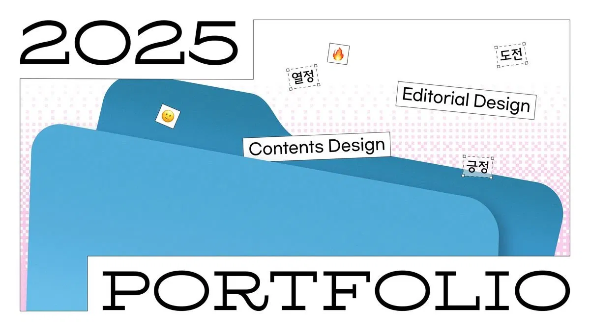
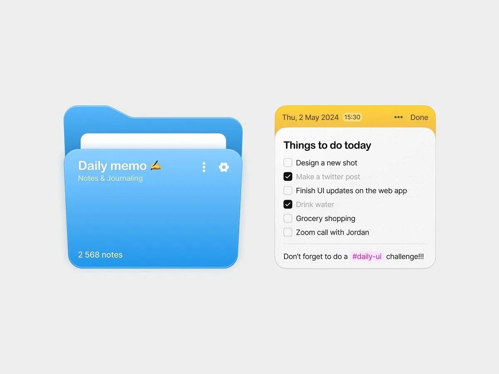
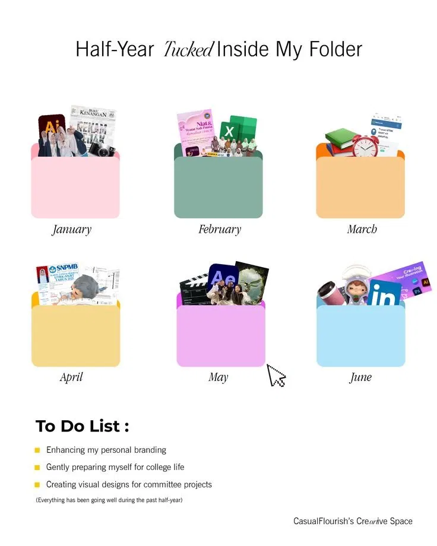

# DESIGN.md

개인 블로그 "ABOUT JINI"의 디자인 명세. 첨부한 레퍼런스 이미지의 분위기 + 아래 팔레트를 기준으로 한다.
- 랜딩페이지 : 
- 디자인참고 : 
- 디자인참고2 : 

## 컨셉
- 굵은 에디토리얼 타이포 + 입체감(광택·그림자) 있는 폴더/카드 + 점선 박스 스티커 라벨.
- 표지는 타이포만 강조, 보관함은 파일철 정리한 느낌.

## 색 (팔레트 고정)
- #FFFDF5  기본 배경 (base white) / 어두운 폴더 위 텍스트
- #364C84  진한 남색 — 텍스트 / 강조 / 폴더 배경
- #95B1EE  밝은 하늘색 — 포인트
- #E7F1A8  밝은 연두 — 포인트
- 규칙: 카테고리(폴더)가 위 색보다 많아지면, 위 색들에서 명도·채도만 살짝 조정한 "비슷한 변형색"을 만들어 쓴다.
  빨강·보라 등 팔레트 밖의 새 색 도입 금지.
- 대비: 밝은 폴더(하늘색·연두·흰색)엔 남색 텍스트, 어두운 폴더(남색)엔 크림(#FFFDF5) 텍스트.

## 글꼴
- 전부 Pretendard로 통일. CDN:
  https://cdn.jsdelivr.net/gh/orioncactus/pretendard/dist/web/variable/pretendardvariable.css
  font-family: "Pretendard Variable", Pretendard, -apple-system, sans-serif;
- 표지 큰 타이틀("ABOUT JINI")은 Pretendard의 굵은 웨이트(Bold~Black)로.

## 입체감 (스큐어모픽)
- 폴더/카드에 미묘한 그라데이션 + 부드러운 그림자로 입체감. 과한 네온/글로우 금지.

## 카테고리 (폴더) — 고정 6개
basic / Values / Favorites / Projects / Running / moments
- **기록 보관함(폴더 그리드)**: 모든 폴더 동일 색상
  - 배경 → #364C84 (`--folder-values`)
  - 텍스트(탭·제목·POST 스티커) → #FFFDF5
  - 다크모드 폴더 배경 → #1F2E55 (`--folder-values` 다크모드 오버라이드)
- **글 목록·태그 등 기타 UI**: 카테고리별 색 매핑 유지(아래는 시작점, 위 변형 규칙을 따른다):
  - basic     → #FFFDF5 (남색 테두리·텍스트)
  - Values    → #364C84 (크림 텍스트)
  - Favorites → #95B1EE
  - Projects  → #E7F1A8
  - Running   → #6E86C4 (밝은 하늘색의 어두운 변형)
  - moments   → #C9DDB0 (밝은 연두의 차분한 변형)
- 폴더(카테고리)를 클릭하면 해당 카테고리의 글 목록으로 이동한다.

## 화면별
- 표지(Cover): "ABOUT JINI" 타이포만 전면 배치. 장식 요소·일러스트·스티커 없음. 연도·의미 없는 장식 카피 X.
- 보관함(Home): 고정 6개 카테고리 = 폴더. 폴더 그리드로 표시. 랜딩에는 헤더 없음.
- 글 목록: 폴더 클릭 시 해당 카테고리 글 목록.
- 글 상세: 글이 주인공, 깔끔하게.

## 모션 / 반응형
- 표지 → 보관함 스크롤 전환은 부드럽게(짧은 페이드/슬라이드). 과한 애니메이션 X.
- 모바일 1열, 데스크톱 폴더 그리드 2~3열.

## 하지 말 것
- 팔레트 밖의 새 색, 연도 표기, 의미 없는 장식 카피.
- 글 내용 하드코딩(글은 Supabase에서).
